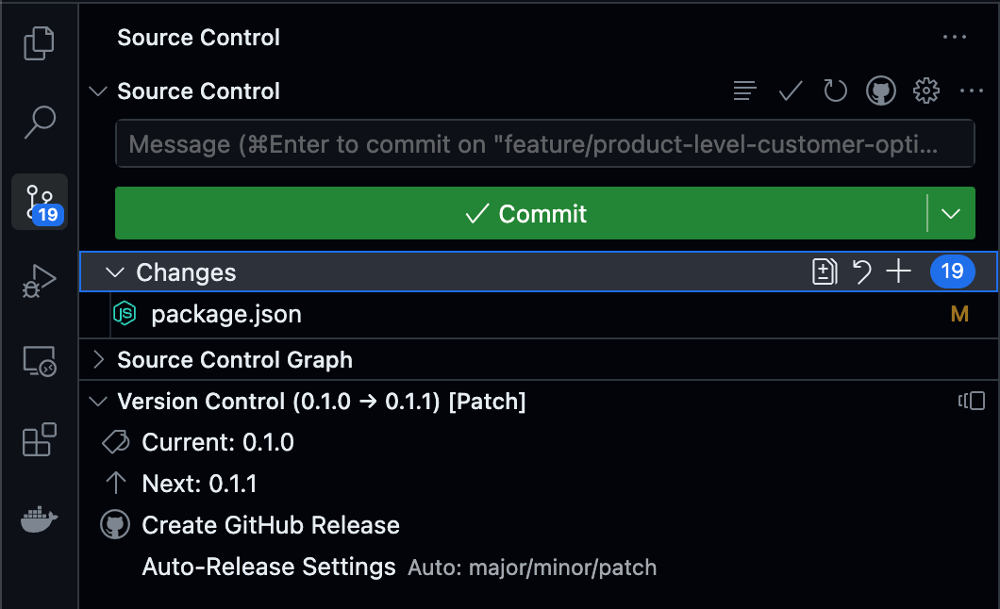

# GitHub Version Sync

Simplify version management and GitHub releases directly from VS Code. Automatically update version numbers, create git tags, and publish GitHub releases with just a few clicks.



---

## ✨ Features

### 🔄 Automatic Version Management
- One-click version bumping (patch, minor, major)
- Automatically updates both `package.json` and `VERSION` file
- Follows semantic versioning (SemVer) standards
- Optional version file path configuration

### 🏷️ Git Integration
- Automatically creates git tags for versions
- Customizable tag prefix (e.g., 'v' for v1.0.0)
- Pushes tags to remote repository
- Maintains clean version history

### 📦 GitHub Release Creation
- Create releases directly from VS Code
- Auto-generates release notes from commits
- Fully editable release descriptions
- Supports both automatic and manual releases
- Configure which version types trigger releases

### 🎨 User-Friendly Interface
- Version control buttons in Source Control panel
- Visual feedback for version changes
- Easy-to-use release creation form
- Quick access to settings

---

## 🚀 Getting Started

1. Install the extension from the [VS Code Marketplace](https://marketplace.visualstudio.com/items?itemName=your-publisher.github-versionsync)

2. Set up GitHub authentication:
   - Generate a [GitHub Personal Access Token](https://github.com/settings/tokens) with `repo` scope
   - VS Code will prompt you to sign in to GitHub when needed

3. Start using:
   - Open your repository in VS Code
   - Look for version control buttons in the Source Control panel
   - Click any version button to bump the version

---

## 💡 Usage Tips

### Version Control

Click these buttons in the Source Control panel to bump versions:
- **Patch** (1.0.0 → 1.0.1): For bug fixes
- **Minor** (1.0.0 → 1.1.0): For new features
- **Major** (1.0.0 → 2.0.0): For breaking changes

### Creating Releases

Two ways to create GitHub releases:
1. **Automatic**: Releases are created when you bump versions (configurable)
2. **Manual**: Click "Create GitHub Release" to make a release anytime

### Release Notes

The release creation form provides:
- Pre-filled release title
- Commit history since last release
- Fully editable notes
- Preview before publishing

---

## ⚙️ Configuration

Customize through VS Code settings:

```jsonc
{
  // Enable/disable automatic git tag creation
  "github-versionsync.enableAutoTag": true,

  // Control when GitHub releases are created (major, minor, patch)
  "github-versionsync.releaseOn": ["major", "minor"],

  // Specify version file name (default: "VERSION")
  "github-versionsync.versionFile": "VERSION",

  // Customize release tag prefix (default: "v")
  "github-versionsync.releasePrefix": "v"
}
```

---

## 📋 Requirements

- VS Code 1.94.0 or higher
- Git repository initialized
- GitHub repository for releases
- GitHub authentication for release creation

---

## ❓ Troubleshooting

Common issues and solutions:

1. **Version not updating**
   - Ensure `package.json` exists in root
   - Check VERSION file path if configured
   - Verify write permissions

2. **GitHub releases not working**
   - Check GitHub authentication
   - Verify repository has remote configured
   - Ensure you have repository write access

3. **Git tags not creating**
   - Check if `enableAutoTag` is true
   - Verify Git is initialized
   - Ensure you have Git push permissions

---

## 📝 Contributing

Want to contribute? Great! See [CONTRIBUTING.md](CONTRIBUTING.md) for development setup and guidelines.

---

## 📄 License

This project is licensed under the MIT License - see the [LICENSE](LICENSE) file for details.