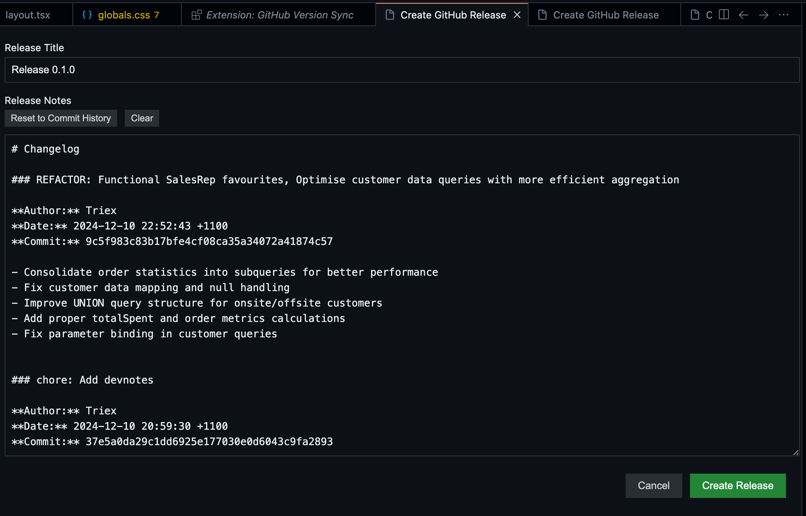

# GitHub Version Sync

Streamline version management and GitHub releases directly from VS Code / your IDE. Automatically update version numbers, create git tags, and publish GitHub releases with just a few clicks.

<div align="center">


*Version control panel with one-click version bumping and GitHub release creation*



*Create beautiful GitHub releases with auto-generated notes from your commits*

</div>

---

## ✨ Features

### 🔄 Automatic Version Management
- One-click version bumping (patch, minor, major)
- Selectively updates version in `package.json` without affecting other changes
- Follows semantic versioning (SemVer) standards
- Automatically amends commit messages with version information

### 🏷️ Git Integration
- Automatically creates git tags for versions
- Tags are created locally first, with optional remote pushing
- Clean version history with version changes as part of feature commits
- Ensures consistent version management across your project

### 📦 GitHub Release Creation
- Create releases directly from VS Code
- Auto-generates release notes from commits (changelog)
- Fully editable release descriptions
- Supports both automatic and manual releases
- Configure which version types trigger releases
- Supports release assets
- Supports release commands

### 🎨 User-Friendly Interface
- Version control buttons in Source Control panel
- Visual feedback for version changes
- Customizable version format in commit messages
- Quick access to settings

---

## 🚀 Getting Started

1. Install the extension from the [VS Code Marketplace](https://marketplace.visualstudio.com/items?itemName=TriexDev.github-versionsync)
2. Open a Git repository with a `package.json` or `VERSION` file
3. Use the Version Control panel in the Source Control section to select version type
4. Commit changes with automatic versioning or manually update versions

---

## 💡 Usage Tips

### Version Control

Click these buttons in the Source Control panel to bump versions:
- **Patch** (1.0.0 → 1.0.1): For bug fixes
- **Minor** (1.0.0 → 1.1.0): For new features
- **Major** (1.0.0 → 2.0.0): For breaking changes

### Creating Releases

Two ways to create GitHub releases:
1. **Automatic**: Releases are created when you bump versions (configurable)
2. **Manual**: Click "Create GitHub Release" to make a release anytime

### Release Notes

The release creation form provides:
- Pre-filled release title
- Commit history since last release
- Fully editable notes
- Preview before publishing

---

## ⚙️ Configuration

Configure the extension through VS Code settings:

- **Version File**: Optionally specify a custom VERSION file path
- **Auto Tag**: Enable/disable automatic Git tag creation
- **Auto Update on Commit**: Automatically update version when committing
- **Enable GitHub Release**: Create GitHub releases when versions change
- **Version Format**: Choose how versions appear in commit messages:
  - **arrow**: `feat: Add feature → v1.2.3` (default)
  - **bump**: `feat: Add feature ⇧ v1.2.3`
  - **simple**: `feat: Add feature v1.2.3`
  - **release**: `feat: Add feature 📦 v1.2.3`
  - **brackets**: `feat: Add feature (v1.2.3)`

Customize through VS Code settings:

```jsonc
{
  // Enable/disable automatic git tag creation
  "github-versionsync.enableAutoTag": true,

  // Control when GitHub releases are created (major, minor, patch)
  "github-versionsync.releaseOn": ["major", "minor"],

  // Specify version file name (default: "VERSION")
  "github-versionsync.versionFile": "VERSION",

  // Customize release tag prefix (default: "v")
  "github-versionsync.releasePrefix": "v",

  // Commands to run before creating a release
  "github-versionsync.preReleaseCommands": [
    "npm run build",
    "vsce package"
  ],

  // Files to include in the release (supports glob patterns)
  "github-versionsync.includePackageFiles": ["*.vsix"]
}
```

### Release Automation

The extension supports automated release workflows through the `preReleaseCommands` and `includePackageFiles` settings:

1. **Pre-Release Commands**: Run build, test, or packaging commands before creating a release:
   ```jsonc
   "github-versionsync.preReleaseCommands": [
     "npm run build",      // Build your project
     "npm test",          // Run tests
     "vsce package"       // Package VS Code extension
   ]
   ```
   Commands run in sequence and must all succeed for the release to proceed.

2. **Release Assets**: Automatically include build artifacts in your release:
   ```jsonc
   "github-versionsync.includePackageFiles": [
     "*.vsix",           // Include VS Code extension packages
     "dist/*.zip",       // Include distribution archives
     "build/*.jar"       // Include built JAR files
   ]
   ```
   Supports glob patterns for flexible file matching.


## 🔑 GitHub Authentication

For GitHub release creation, the extension requires a GitHub token:

1. Go to your [GitHub Token Settings](https://github.com/settings/tokens)
2. Create a token with the `repo` scope
3. The extension will prompt for this token when needed
4. Tokens are securely stored in VS Code's built-in secret storage

## 📚 Commands

Access these commands via the Command Palette (`Ctrl+Shift+P` / `Cmd+Shift+P`):

- `Version Control: Select Version Type` - Set the type of version update
- `Version Control: Toggle GitHub Releases` - Enable/disable GitHub release creation
- `Version Control: Create GitHub Release` - Manually create a release
- `Version Control: Commit with Version` - Stage changes and commit with version

---

## 📋 Requirements

- Visual Studio Code v1.94.0 or higher
- Git installed and configured
- Node.js v18.0.0 or higher

---

## ❓ Troubleshooting

Common issues and solutions:

1. **Version not updating**
   - Ensure `package.json` exists in root
   - Check VERSION file path if configured
   - Verify write permissions

2. **GitHub releases not working**
   - Check GitHub authentication
   - Verify repository has remote configured
   - Ensure you have repository write access

3. **Git tags not creating**
   - Check if `enableAutoTag` is true
   - Verify Git is initialized
   - Ensure you have Git push permissions

---

## 📝 Contributing

Want to contribute? Great! See [CONTRIBUTING.md](CONTRIBUTING.md) for development setup and guidelines.

---

## 🐛 Reporting Issues

Found a bug or have a feature request? Please [open an issue](https://github.com/TriexDev/GitHub-Version-Sync/issues/new) on GitHub.

---

## 📄 No License

This extension currently has no license.